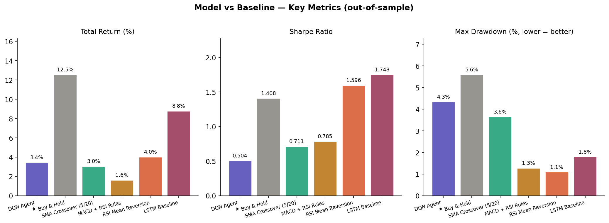

# Stock Price ML Pipeline


An end-to-end MLOps pipeline using stock price prediction as the domain.  
The engineering patterns demonstrated here — orchestrated ingestion, versioned feature store, automated model promotion, drift monitoring — are domain-agnostic and apply to any production ML system.

---

## Pipeline overview

```
┌─────────────────────────────────────────────────────────────┐
│  L1  Ingestion          (Airflow DAG, daily @ 18:00 TPE)    │
│      yfinance → 8-check quality gate → data/raw/            │
├─────────────────────────────────────────────────────────────┤
│  L2  Feature Store      (versioned by execution date)        │
│      MACD / RSI / BB / ATR → data/features/{ticker}/{date}/ │
├─────────────────────────────────────────────────────────────┤
│  L3  Training Pipeline  (MLflow experiment tracking)         │
│      DQN Agent + Optuna search → MLflow Model Registry       │
├─────────────────────────────────────────────────────────────┤
│  L4  Model Promotion    (automated, Sharpe-gated)            │
│      Staging → Production if ΔSharpe ≥ 0.05                 │
├─────────────────────────────────────────────────────────────┤
│  L5  Monitoring         (weekly drift check)                 │
│      PSI per feature → retrain trigger if PSI ≥ 0.10        │
└─────────────────────────────────────────────────────────────┘
```

---

## Design decisions

### Why Airflow over cron?
Task-level dependency management, retry logic, backfill capability, and a UI for monitoring failures. The `stock_pipeline` DAG chains four tasks per ticker — if `validate_quality` fails, `compute_features` never runs, preventing bad data from entering the feature store.

### Why versioned feature store instead of recomputing on-the-fly?
Reproducibility: any training run can be pinned to a specific feature version. Prevents train/serve skew: serving reads from the same Parquet schema as training. Enables rollback: if a bad feature version causes model degradation, revert to the previous date's features.

### Why PSI for drift detection?
PSI (Population Stability Index) is the industry standard in financial ML. Unlike statistical tests (KS, chi-squared), PSI gives an interpretable magnitude — 0.1 = monitor, 0.2 = retrain. It runs weekly as the last task in the ingestion DAG and sets a flag that the retrain DAG reads.

### Why Sharpe ratio as the promotion criterion?
Total return is gameable (a model that holds all-in during a bull run beats everything). Sharpe normalises for volatility — a model with Sharpe 1.2 and 15% return is better than one with Sharpe 0.4 and 30% return. The 0.05 threshold prevents noise-driven promotions.

---

## Model performance vs baselines

```bash
python scripts/run_comparison.py
```

| Rank | Strategy | Return % | Sharpe | Max DD % | Win Rate % |
|------|----------|:--------:|:------:|:--------:|:----------:|
| — | *Run comparison script to populate* | | | | |




---

## Repository structure

```
dags/
├── stock_pipeline.py       # L1-L2: daily ingestion → quality → features → drift
└── retrain_pipeline.py     # L3-L4: weekly retrain → evaluate → promote

src/
├── data/
│   └── downloader.py       # yfinance fetch + Parquet cache
├── features/
│   └── indicators.py       # MACD, RSI, Bollinger Bands, ATR
├── models/
│   ├── dqn_agent.py        # Deep Q-Network (TF2 Keras, serializable)
│   └── cnn_agent.py        # CNN Q-Network
├── baselines/
│   ├── strategies.py       # Buy&Hold, SMA crossover, MACD/RSI, RSI rules
│   └── lstm_model.py       # LSTM baseline for comparison
├── backtest/
│   └── engine.py           # Sharpe, MDD, Win rate, Calmar + stop-loss
├── monitoring/
│   ├── data_quality.py     # 8 raw checks + 4 feature checks
│   └── drift.py            # PSI computation + feature drift report
└── utils/
    └── device.py           # Cross-platform GPU configuration

scripts/
├── train_mlflow.py         # Train DQN + log to MLflow
├── tune_hyperparams.py     # Optuna hyperparameter search
├── promote_model.py        # Compare Staging vs Production, promote if better
├── run_comparison.py       # Baseline comparison → results/
└── evaluate.py             # Single model evaluation + HTML chart

api/
└── main.py                 # FastAPI inference endpoint (optional serving layer)

tests/                      # 65+ pytest tests
.github/workflows/
├── ci.yml                  # test + lint + pipeline smoke test + docker build
└── comparison.yml          # weekly baseline comparison (scheduled)
```

---

## Local setup

```bash
# Install dependencies
pip install -r requirements.txt
# Windows GPU (optional):
pip install tensorflow-directml-plugin

# Run the full daily pipeline locally (no Airflow needed)
python dags/stock_pipeline.py --run-local --ticker ^TWII

# Train a model
python scripts/train_mlflow.py --ticker ^TWII --model dqn --use-macd

# View experiments
mlflow ui --backend-store-uri sqlite:///mlruns.db
# → http://localhost:5000

# Check if new model should be promoted
python scripts/promote_model.py --dry-run

# Run baseline comparison (generates results/ images for README)
python scripts/run_comparison.py

# Run tests
pytest tests/ -v --cov=src
```

## Docker (full MLOps stack)

```bash
docker-compose up

# Airflow UI  → http://localhost:8080  (admin / admin)
# MLflow UI   → http://localhost:5000
```

The compose stack runs: Postgres (metadata + MLflow backend) → MLflow server → Airflow (webserver + scheduler). DAGs are volume-mounted so changes are picked up without rebuilding.

---

## Key engineering patterns

| Pattern | Implementation | File |
|---------|---------------|------|
| DAG with fail-fast quality gate | `validate_quality` blocks `compute_features` | `dags/stock_pipeline.py` |
| Versioned feature store | Date-stamped Parquet + `latest.parquet` pointer | `dags/stock_pipeline.py` |
| Drift-triggered retraining | `ShortCircuitOperator` reads PSI log | `dags/retrain_pipeline.py` |
| Guarded model promotion | ΔSharpe ≥ 0.05, old model → Archived | `scripts/promote_model.py` |
| Reproducible experiments | MLflow params + metrics + artifact per run | `scripts/train_mlflow.py` |
| Cross-platform GPU | try DirectML → CUDA → CPU fallback | `src/utils/device.py` |
| CI pipeline smoke test | Validates DAG imports + quality module | `.github/workflows/ci.yml` |

---

*Originally a 4-person group project (2023). Rebuilt to demonstrate DE/MLE pipeline engineering.*
