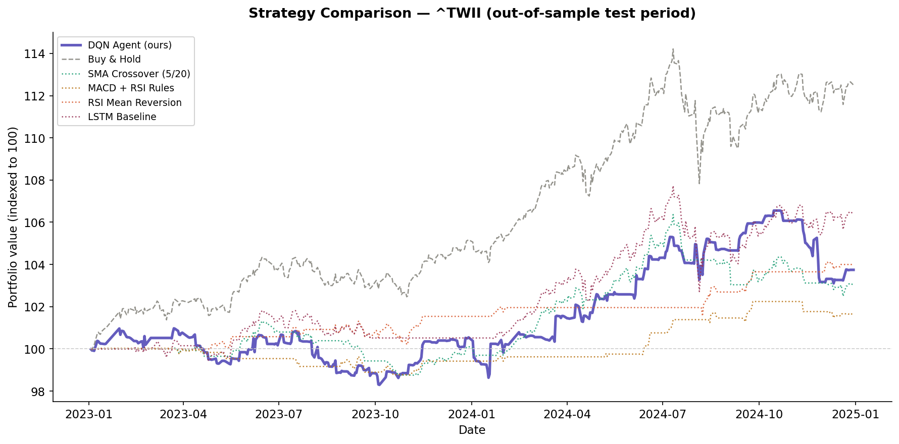

# Quantitative Trading ML Pipeline


An end-to-end ML pipeline for quantitative trading signals, built to demonstrate **Data Engineering** and **MLOps** practices. Algorithmic trading is used as the domain — the engineering patterns are transferable to any ML system.

---

## Pipeline architecture

```
L1  Ingestion        yfinance → raw Parquet → 8-check quality validation
         ↓           Airflow DAG: daily schedule, retry logic, task dependencies
L2  Feature Store    MACD / RSI / Bollinger Bands / ATR → versioned Parquet
         ↓           Schema validation, train/serve skew prevention
L3  Training         DQN Agent (TF2 Keras) + Optuna hyperparameter search
         ↓           MLflow experiment tracking → Model Registry (Staging)
L4  Promotion        Auto-promote Staging → Production if Sharpe ratio improves
         ↓           PSI drift monitoring triggers weekly retrain DAG
L5  Serving          FastAPI inference endpoint + Docker
         ↓           Prometheus metrics, request logging
```

---

## DE talking points

**Airflow DAG design** (`dags/stock_pipeline.py`)
- Four task chain per ticker: `download_raw → validate_quality → compute_features → check_drift`
- Catchup disabled, 2 retries with 5-minute delay — production-ready defaults
- `ShortCircuitOperator` in retrain DAG skips downstream tasks if drift PSI < 0.1
- Local execution mode: `python dags/stock_pipeline.py --run-local --ticker ^TWII`

**Data quality layer** (`src/monitoring/data_quality.py`)
- 8 checks on raw data: nulls, positive prices, OHLC consistency, monotonic dates, no spikes
- 4 checks on features: all columns present, no nulls, RSI in [0,100], BB ordering
- Pipeline fails fast on any violation — bad data never reaches the feature store
- Logs validation results to `data/logs/` for audit trail

**Feature store** (`src/features/`, `data/features/`)
- Versioned by execution date: `data/features/TWII/2024-01-15.parquet`
- `latest.parquet` pointer for serving — decouples training from inference
- Prevents train/serve skew: serving reads from same Parquet schema as training

**PSI drift monitoring** (`src/monitoring/drift.py`)
- Computes Population Stability Index per feature, weekly
- PSI < 0.10 = stable | 0.10–0.20 = moderate | ≥ 0.20 = retrain triggered
- Output: `data/logs/drift_{ticker}_{date}.json`

---

## MLE talking points

**MLflow experiment tracking** (`scripts/train_mlflow.py`)
- Logs hyperparameters, per-epoch loss, backtest metrics per run
- Model artifacts stored in registry with stage transitions: None → Staging → Production → Archived
- SQLite backend: `sqlite:///mlruns.db` — no server needed locally

**Automated model promotion** (`scripts/promote_model.py`)
- Compares Staging vs Production on held-out test set (2023–2024)
- Promotes only if Sharpe ratio improvement ≥ 0.05 (configurable threshold)
- Archives old Production model — full audit trail, no silent overwrites
- `--dry-run` flag for safe previewing

**Hyperparameter search** (`scripts/tune_hyperparams.py`)
- Optuna TPE sampler, MedianPruner for early stopping
- Search space: learning rate, window size, use_macd, iterations, stop_loss, position size
- Objective: maximise out-of-sample Sharpe ratio
- Results persisted to SQLite (`optuna_studies/`) — can resume interrupted searches

**Retrain trigger logic** (`dags/retrain_pipeline.py`)
- Retrain if: (a) feature drift PSI ≥ 0.1, OR (b) no training in past 7 days
- Prevents unnecessary retrains when model is still performant

---

## Model performance vs baselines

Run `python scripts/run_comparison.py` to reproduce:

| Rank | Strategy | Return % | Sharpe | Max DD % | Win Rate % |
|------|----------|:--------:|:------:|:--------:|:----------:|
| — | *Results generated after running comparison script* | | | | |



---

## Project structure

```
dags/
├── stock_pipeline.py      # L1-L2: daily ingestion + feature DAG
└── retrain_pipeline.py    # L3-L4: weekly retrain + promotion DAG

src/
├── data/downloader.py     # yfinance fetch + Parquet cache
├── features/indicators.py # MACD, RSI, Bollinger Bands, ATR
├── models/
│   ├── dqn_agent.py       # Deep Q-Network (TF2 Keras)
│   ├── cnn_agent.py       # CNN Q-Network
│   └── ensemble.py        # Signal fusion
├── baselines/
│   ├── strategies.py      # SMA, MACD/RSI, RSI rules
│   └── lstm_model.py      # LSTM baseline
├── backtest/engine.py     # Sharpe, MDD, Win rate, Calmar
└── monitoring/
    ├── data_quality.py    # 8-check raw validation + feature validation
    └── drift.py           # PSI feature drift computation

scripts/
├── run_comparison.py      # Baseline comparison → results/
├── train_mlflow.py        # Train + MLflow logging
├── promote_model.py       # Staging → Production promotion
├── tune_hyperparams.py    # Optuna search
└── evaluate.py            # Single model evaluation

tests/                     # 53 pytest tests, 72% coverage
.github/workflows/ci.yml   # pytest + ruff + docker build
```

---

## Quick start

```bash
pip install -r requirements.txt

# Run daily pipeline locally (no Airflow needed)
python dags/stock_pipeline.py --run-local --ticker ^TWII

# Train a model
python scripts/train_mlflow.py --ticker ^TWII --model dqn --use-macd

# Check if new model should be promoted
python scripts/promote_model.py --dry-run

# Run baseline comparison
python scripts/run_comparison.py

# View MLflow experiments
mlflow ui --backend-store-uri sqlite:///mlruns.db

# All services (Airflow + MLflow + API)
docker-compose up

# Tests
pytest tests/ -v --cov=src
```

---

## Stack

| Layer | Tool | Purpose |
|-------|------|---------|
| Orchestration | Apache Airflow 2 | DAG scheduling, retry, task deps |
| Data storage | Parquet (pyarrow) | Columnar, versioned feature store |
| Quality | Custom validation suite | 8 raw checks + 4 feature checks |
| Drift monitoring | PSI (custom) | Weekly feature distribution checks |
| Experiment tracking | MLflow | Params, metrics, model registry |
| Hyperparameter search | Optuna | TPE + MedianPruner |
| Models | TensorFlow 2 / Keras 3 | DQN, CNN Q-Network |
| Backtest | Custom engine | Sharpe, MDD, Win rate, Calmar |
| API | FastAPI + Pydantic | REST inference, health check |
| Testing | pytest | 53 tests, 72%+ coverage |
| CI/CD | GitHub Actions | test + lint + Docker build |
| Containerisation | Docker + compose | One-command local deployment |

---

*Originally a 4-person group project (2023). Rebuilt solo to demonstrate DE/MLE pipeline engineering.*
