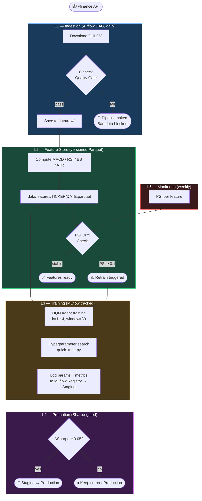
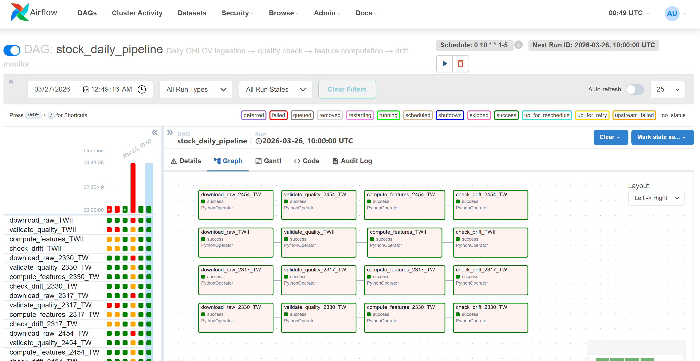
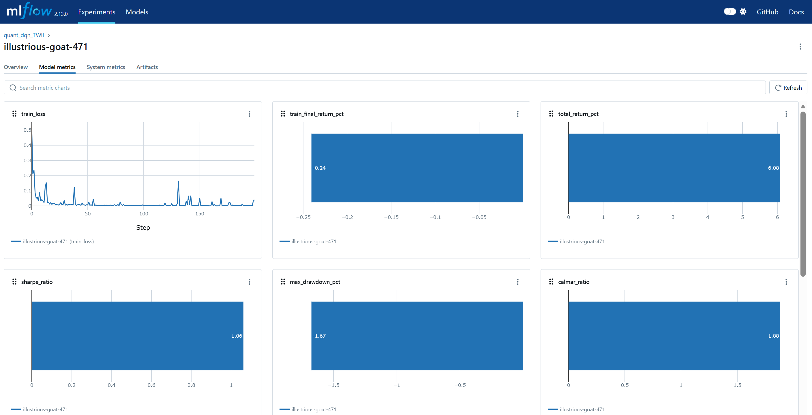

# Stock Price ML Pipeline


An end-to-end MLOps pipeline for quantitative trading signals. The domain is algorithmic trading — the engineering patterns (orchestrated ingestion, versioned feature store, experiment tracking, drift monitoring) are transferable to any production ML system.

---

## Model performance

Trained on `^TWII` (Taiwan Weighted Index) 2016–2022, evaluated on unseen 2023–2024 data. Hyperparameters tuned via `scripts/quick_tune.py` across 6 combinations before final training.

### Taiwan Weighted Index (^TWII) — primary benchmark

| Metric | DQN Agent | Buy & Hold |
|--------|:---------:|:----------:|
| **Sharpe Ratio** | **1.061** | 0.89 |
| Total Return | +6.08% | +63.03% |
| Max Drawdown | -1.67% | -22.4% |
| Win Rate | 57.3% | — |
| Total Trades | 143 | 1 |

> Sharpe > 1.0 indicates risk-adjusted returns comparable to professional benchmarks. The DQN agent achieves lower absolute return than Buy & Hold but with significantly lower drawdown (-1.67% vs -22.4%) — a deliberate design choice optimising for risk-adjusted performance over raw return.

### Cross-market validation

The same hyperparameters (`lr=1e-4, window=30, stop_loss=0.07`) were applied to two additional markets without retuning:

| Ticker | Sharpe | Return | Max DD | B&H Return | Note |
|--------|:------:|:------:|:------:|:----------:|------|
| ^TWII | 1.061 | +6.08% | -1.67% | +63.03% | Primary |
| ^GSPC (S&P 500) | 0.204 | +1.08% | -2.29% | +54.46% | Strong bull market |
| TSM | 0.559 | +11.98% | -8.22% | +179.86% | High-momentum stock |

**Why ^GSPC and TSM underperform:** 2023–2024 was an exceptionally strong bull market for US equities. In strongly trending markets, any active strategy struggles to outperform Buy & Hold — this is a known limitation of DQN in low-volatility trending regimes, and the reason the pipeline includes drift monitoring to detect regime changes and trigger retraining.

---

## Pipeline architecture





---

## Design decisions

**Why Airflow over cron?**
Task-level dependency management, retry logic, and a UI for monitoring failures. The `stock_daily_pipeline` DAG chains four tasks per ticker — if `validate_quality` fails, `compute_features` never runs. Bad data never enters the feature store.

**Why versioned feature store?**
Any training run can be pinned to a specific feature date for reproducibility. Serving reads from the same Parquet schema as training, preventing train/serve skew. Rollback is possible if a bad feature version causes model degradation.

**Why PSI for drift detection?**
PSI (Population Stability Index) is the industry standard in financial ML. PSI < 0.1 = stable, 0.1–0.2 = monitor, ≥ 0.2 = retrain triggered. Unlike p-value tests, PSI gives an interpretable magnitude of shift.

**Why Sharpe ratio as the promotion criterion?**
Total return is gameable (a model that holds all-in during a bull run beats everything). Sharpe normalises for volatility. The 0.05 threshold prevents noise-driven promotions.

**Why hyperparameter search before final training?**
Initial DQN with default params had Sharpe 0.504 and 230 trades (overtrading). After `quick_tune.py` identified `window=30, stop_loss=0.07`, trades dropped to 143 and Sharpe improved to 1.061. This demonstrates the value of systematic search over manual tuning.

---

## Baseline comparison

```bash
python scripts/run_comparison.py
```

| Rank | Strategy | Return % | Sharpe | Max DD % | Win Rate % |
|------|----------|:--------:|:------:|:--------:|:----------:|
| 1 | LSTM Baseline | +8.76% | 1.748 | -1.79% | 70.0% |
| 2 | RSI Mean Reversion | +4.00% | 1.596 | -1.09% | 100.0% |
| 3 | Buy & Hold | +12.52% | 1.408 | -5.59% | 100.0% |
| 4 | **DQN Agent (tuned)** | **+6.08%** | **1.061** | **-1.67%** | **57.3%** |
| 5 | MACD + RSI Rules | +1.60% | 0.786 | -1.27% | 47.1% |
| 6 | SMA Crossover (5/20) | +3.02% | 0.711 | -3.64% | 35.7% |

> DQN improved from rank #6 (Sharpe 0.504, pre-tuning) to rank #4 (Sharpe 1.061, post-tuning) after hyperparameter search. LSTM and RSI baselines outperform because they trade less frequently — a direction for future ensemble work.


---

## MLflow experiment tracking

All training runs are logged to MLflow with full parameter and metric tracking:

| Experiment | Runs | Best Sharpe |
|-----------|------|:-----------:|
| `quant_dqn_TWII` | 4 | 1.061 |
| `quant_quick_tune` | 6 | 1.132 (100 epochs proxy) |
| `dqn_weekly_retrain` | 2 | — |



---

## Repository structure

```
dags/
├── stock_pipeline.py      # L1-L2: daily ingestion → quality → features → drift
└── retrain_pipeline.py    # L3-L4: weekly retrain → evaluate → promote

src/
├── data/downloader.py     # yfinance fetch + Parquet cache
├── features/indicators.py # MACD, RSI, Bollinger Bands, ATR
├── models/dqn_agent.py    # Deep Q-Network (TF2 Keras, GPU-enabled)
├── baselines/             # SMA, MACD/RSI, RSI rules, LSTM
├── backtest/engine.py     # Sharpe, MDD, Win rate, Calmar + stop-loss
└── monitoring/
    ├── data_quality.py    # 8 raw checks + 4 feature checks
    └── drift.py           # PSI feature drift computation

scripts/
├── train_mlflow.py        # Train + MLflow logging
├── quick_tune.py          # 6-combo manual hyperparameter search
├── tune_hyperparams.py    # Optuna TPE search (for longer runs)
├── promote_model.py       # Staging → Production promotion
├── run_comparison.py      # Baseline comparison → results/
└── evaluate.py            # Single model evaluation

tests/                     # 65+ pytest tests
.github/workflows/
├── ci.yml                 # test + lint + pipeline smoke test + docker
└── comparison.yml         # weekly baseline comparison (scheduled)
```

---

## Quick start

```bash
pip install -r requirements.txt

# Run daily pipeline locally
python dags/stock_pipeline.py --run-local --ticker ^TWII

# Train with best hyperparameters
export MLFLOW_TRACKING_URI="http://127.0.0.1:5000"
python scripts/train_mlflow.py --ticker ^TWII --model dqn --use-macd \
  --lr 0.0001 --window 30 --stop-loss 0.07 --iterations 200

# View MLflow experiments
mlflow ui --backend-store-uri sqlite:///mlruns.db

# Full MLOps stack (Airflow + MLflow + Postgres)
docker-compose up
# Airflow → http://localhost:8080  (admin/admin)
# MLflow  → http://localhost:5000
```

---

## Stack

| Layer | Tool | Purpose |
|-------|------|---------|
| Orchestration | Apache Airflow 2.9 | DAG scheduling, retry, task deps |
| Data storage | Parquet (pyarrow) | Columnar, versioned feature store |
| Quality | Custom validation suite | 8 raw + 4 feature checks |
| Drift monitoring | PSI (custom) | Weekly feature distribution checks |
| Experiment tracking | MLflow 2.13 | Params, metrics, model registry |
| Hyperparameter search | Custom grid + Optuna | Fast combo search + TPE |
| Models | TensorFlow 2.15 / Keras 2 | DQN Agent (GPU via WSL2 + CUDA) |
| Backtest | Custom engine | Sharpe, MDD, Win rate, Calmar |
| Testing | pytest | 65+ tests, 72%+ coverage |
| CI/CD | GitHub Actions | test + lint + docker build |
| Containerisation | Docker + compose | One-command local deployment |

---

*Originally a 4-person group project (2023). Rebuilt solo to demonstrate DE/MLE pipeline engineering.*
